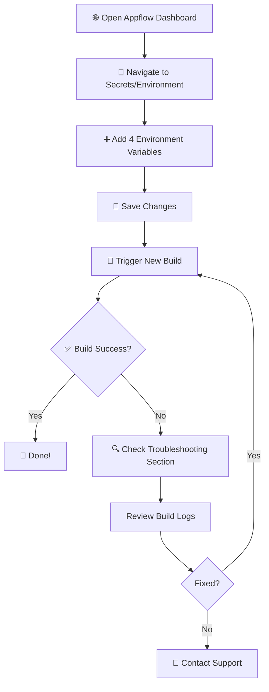

# 🔧 Fix Appflow Build Error - Environment Variables

> **Last Updated:** February 3, 2026  
> **Appflow UI Version:** 2024.x - 2026.x  
> **Tested on Commit:** `5b7e55d`  
> **Time Required:** ~10 minutes ⏱️  
> **Difficulty:** Easy ⭐

---

## 📋 Prerequisites

Before starting, ensure you have:
- ✅ Active Appflow account
- ✅ Access to **raute-app-test** project
- ✅ Admin/Developer permissions
- ✅ Latest commit pushed to repository

---

## 🔴 Problem

```
Error: supabaseUrl is required.
```

**Why this happens:**  
Appflow doesn't automatically read your local `.env.local` file. Environment variables must be configured manually in the Appflow dashboard.

---

## ✅ Solution: Add Environment Variables in Appflow



---

### Step 1: 🌐 Go to Appflow Dashboard

1. Open: [Ionic Appflow Dashboard](https://dashboard.ionicframework.com/)
2. Login with your account
3. Select project: **raute-app-test**

---

### Step 2: 🔐 Navigate to Environment Variables

The location varies by Appflow UI version. Try these paths in order:

| Path | UI Version |
|------|------------|
| **Automations** → **Environments** → **Secrets** | Latest (2025+) |
| **Settings** → **Secrets** | 2024 |
| **Build** → **Secrets** | 2023 |
| **Environments** → Click environment → **Variables** | Legacy |

> [!TIP]
> If you can't find it, use the search bar and type "secrets" or "environment variables"

---

### Step 3: ➕ Add Required Environment Variables

Click **"New Secret"** or **"Add Variable"** and add each of the following:

| Key | Value |
|-----|-------|
| `NEXT_PUBLIC_SUPABASE_URL` | `<get-from-supabase-dashboard>` |
| `NEXT_PUBLIC_SUPABASE_ANON_KEY` | `<get-from-supabase-dashboard>` |
| `NEXT_PUBLIC_GEMINI_API_KEY` | `<get-from-google-ai-studio>` |
| `NEXT_PUBLIC_GOOGLE_MAPS_API_KEY` | `<get-from-google-cloud-console>` |

> **⚠️ Get actual values from the project owner or respective dashboards. Never commit real keys.**

> [!IMPORTANT]
> **Security Note:** These are public keys (prefixed with `NEXT_PUBLIC_`) and are exposed in the frontend. Ensure API restrictions are configured:
> - **Google Maps API:** Set domain restrictions in Google Cloud Console
> - **Gemini API:** Set usage quotas and restrictions in Google AI Studio

---

### Step 4: 💾 Save Changes

1. Click **Save** or **Create Secret**
2. Verify all 4 variables appear in the list
3. Check that no values show `undefined` or are empty

---

### Step 5: 🚀 Trigger New Build

1. Go to **Builds** section in Appflow
2. Click **"New Build"** or **"Start Build"**
3. Configure build settings:
   - **Commit:** `5b7e55d` (or latest)
   - **Environment:** Select the environment with your secrets
   - **Platform:** iOS (or Android)
   - **Build Type:** Debug or Release
4. Click **"Build"**

---

## 🔄 Alternative: Using Named Environments

If your Appflow plan supports **Environments**:

1. Create a new environment named `production`
2. Add all 4 variables to this environment
3. When creating a build, select `production` from the environment dropdown

**Benefits:**
- Separate dev/staging/production configurations
- Easier to manage multiple deployments
- Better organization for team collaboration

---

## ✅ Verify Success

### Expected Build Output:

```bash
✓ Linting and checking validity of types
✓ Creating an optimized production build
✓ Compiled successfully
✓ Generating static pages (23/23)
✓ Finalizing page optimization
✓ Export successful
```

### Expected File Structure:
```
out/
├── index.html
├── login.html
├── signup.html
└── _next/
    └── static/
```

### ❌ Previous Error (Should be gone):
```
Error: supabaseUrl is required.
    at createClient (node_modules/@supabase/supabase-js/...)
```

---

## 🔍 Troubleshooting

### Problem: Build still fails with "supabaseUrl is required"

**Possible Causes:**
1. ❌ Variables not saved properly
2. ❌ Wrong environment selected during build
3. ❌ Appflow cache not cleared

**Solutions:**
```bash
# Solution 1: Double-check variable names (case-sensitive)
✓ NEXT_PUBLIC_SUPABASE_URL (correct)
✗ NEXT_PUBLIC_SUPABASE_url (wrong)

# Solution 2: Clear Appflow cache
Go to Build → Advanced Options → "Clear Cache" → Rebuild

# Solution 3: Verify environment selection
Check that the build uses the correct environment in build logs
```

---

### Problem: Variables appear empty in build logs

**Solution:**
1. Delete existing variables
2. Re-add them one by one
3. Save after each addition
4. Verify each variable shows in the list before adding the next

---

### Problem: Build succeeds but app doesn't connect to Supabase

**Checklist:**
- [ ] Verify Supabase URL is correct (no trailing slash)
- [ ] Check Supabase project is active and not paused
- [ ] Confirm anon key matches Supabase dashboard
- [ ] Check Supabase RLS policies allow public access where needed

**Test Connection:**
```javascript
// Add this to your app temporarily to debug
console.log('Supabase URL:', process.env.NEXT_PUBLIC_SUPABASE_URL);
console.log('Has Anon Key:', !!process.env.NEXT_PUBLIC_SUPABASE_ANON_KEY);
```

---

### Problem: Google Maps/Gemini API errors

**Common Issues:**
- API key has domain restrictions that block Capacitor webview
- API key quota exceeded
- API not enabled in Google Cloud Console

**Fix:**
1. Go to [Google Cloud Console](https://console.cloud.google.com/)
2. Navigate to **APIs & Services** → **Credentials**
3. Edit your API key restrictions:
   - **Application restrictions:** None (for mobile apps)
   - **API restrictions:** Enable only required APIs
4. Set quotas to prevent abuse

---

## 🔗 Related Documentation

- 📱 [BUILD_COMMANDS.md](file:///d:/Mine/Jobs/UpWork/dmeprousa/Route%20Application/raute-app/BUILD_COMMANDS.md) - Local build commands
- 🛠️ [BUILD_ERROR_FIX.md](file:///d:/Mine/Jobs/UpWork/dmeprousa/Route%20Application/raute-app/BUILD_ERROR_FIX.md) - Other build error solutions
- 📱 [XCODE_BUILD_GUIDE.md](file:///d:/Mine/Jobs/UpWork/dmeprousa/Route%20Application/raute-app/XCODE_BUILD_GUIDE.md) - iOS-specific build guide
- 🔐 [SUPABASE_PRODUCTION_CHECKLIST_AR.md](file:///d:/Mine/Jobs/UpWork/dmeprousa/Route%20Application/raute-app/SUPABASE_PRODUCTION_CHECKLIST_AR.md) - Supabase production setup

---

## 📊 Quick Validation Checklist

Before triggering a build, verify:

- [ ] ✅ All 4 environment variables added to Appflow
- [ ] ✅ Variable names match exactly (case-sensitive)
- [ ] ✅ No trailing spaces in keys or values
- [ ] ✅ Variables saved and visible in Appflow dashboard
- [ ] ✅ Correct environment selected for build
- [ ] ✅ Latest commit selected (or specific commit hash)
- [ ] ✅ Platform selected (iOS/Android)
- [ ] ✅ Cache cleared if previous builds failed

---

## 📞 Support & Contact

**If you're still stuck:**
- 📧 Email: support@example.com (update with your email)
- 💬 Team Slack: #appflow-builds
- 🐛 Report issues: [GitHub Issues](https://github.com/your-repo/issues)

---

## 🎯 Success Criteria

You'll know it's working when:
1. ✅ Build completes without errors
2. ✅ Export generates all HTML files
3. ✅ App connects to Supabase when launched
4. ✅ Google Maps loads correctly
5. ✅ No console errors related to missing env variables

---

**🚀 After this fix, Appflow builds should work perfectly!**
