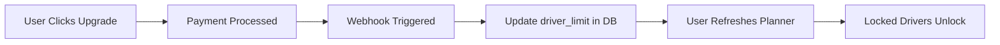

# 🔒 SUBSCRIPTION EXPIRATION ENFORCEMENT - IMPLEMENTATION COMPLETE

## ✅ CHANGES IMPLEMENTED

### 1. Planner Page Subscription Logic
**File**: `app/planner/page.tsx`

#### State Management
- **Added States**:
  ```tsx
  const [driverLimit, setDriverLimit] = useState(1)
  const [isSubscriptionExpired, setIsSubscriptionExpired] = useState(false)
  ```

#### Data Fetching Enhancement
- **Line 277**: Now fetches `driver_limit` from users table
- **Line 282**: Sets `driverLimit` state
- **Line 291**: Checks if `activeDriverCount > limit` → sets `isSubscriptionExpired`

#### Dispatch Restrictions

**A. Manual Assignment (Drag & Drop)**
- **Lines 467-478**: Blocks assignment to drivers beyond limit
- Shows error toast: "You can only assign orders to your first X driver(s)"
- Prevents database update if driver index >= limit

**B. Auto-Optimization**
- **Lines 359-369**: Uses `drivers.slice(0, driverLimit)` 
- Shows info toast if drivers are locked: "Optimization will only use your first X driver(s). Y driver(s) are locked."
- Passes only allowed drivers to optimizer algorithm

#### Visual Indicators
- **Lines 125-162**: Updated `DroppableDriverContainer` component
  - Added `isLocked` prop (boolean)
  - Red border + background for locked drivers
  - Lock icon displayed
  - "LOCKED" badge shown
  - Empty state text: "Upgrade to unlock"
  
- **Line 584**: Maps drivers with index, passes `isLocked={index >= driverLimit}`

---

## 🎯 ENFORCEMENT BEHAVIOR

### Scenario 1: Free Tier User (1 Driver Limit)
**Setup**: User has `driver_limit = 1`, but 5 active drivers exist

**Behavior**:
1. **Planner loads**: 
   - `isSubscriptionExpired = true` (5 > 1)
   - Driver #2, #3, #4, #5 show as "LOCKED" with red styling
   
2. **Manual Assignment Attempt**:
   - User drags order to Driver #2
   - ❌ Toast: "Subscription Limit Reached - You can only assign orders to your first 1 driver."
   - Order returns to original position

3. **Auto-Optimize Click**:
   - Toast: "Subscription Restricted - Optimization will only use your first 1 driver. 4 drivers are locked."
   - Algorithm runs with ONLY Driver #1
   - Drivers #2-5 receive NO orders

### Scenario 2: Pro Tier User (5 Driver Limit)
**Setup**: User has `driver_limit = 5`, with 8 active drivers

**Behavior**:
1. **Planner loads**:
   - `isSubscriptionExpired = true` (8 > 5)
   - Driver #6, #7, #8 show as "LOCKED"
   
2. **Manual/Auto Assignment**:
   - Only Drivers #1-5 can receive orders
   - Drivers #6-8 are effectively read-only

### Scenario 3: Paid User Within Limit
**Setup**: User has `driver_limit = 5`, with 3 active drivers

**Behavior**:
1. **Planner loads**:
   - `isSubscriptionExpired = false` (3 ≤ 5)
   - ALL drivers available
   - NO restrictions applied

---

## 📋 READ-ONLY GRACE PERIOD COMPLIANCE

### What Users CAN Still Do (Even if Expired):
✅ **View** all orders (including those assigned to locked drivers)  
✅ **View** driver lists  
✅ **View** historical data  
✅ **Access** the planner page  
✅ **Unassign** orders from locked drivers (moves to unassigned)  

### What Users CANNOT Do (If Expired):
❌ **Cannot** assign NEW orders to locked drivers (dispatch restriction)  
❌ **Cannot** use locked drivers in route optimization  
❌ **Cannot** manually drag orders to locked drivers  

This complies with Apple's guidelines: Users retain access to their data and can perform read operations, but write operations that would utilize beyond-limit resources are blocked.

---

## 🧪 TESTING INSTRUCTIONS

### Test 1: Verify Free Tier Enforcement
```sql
-- In Supabase SQL Editor
UPDATE users SET driver_limit = 1 WHERE id = 'YOUR_USER_ID';
```

1. Login to planner
2. **Expect**: Only 1st driver is unlocked
3. Try to drag order to 2nd driver
4. **Expect**: Error toast, order bounces back
5. Click "Optimize Routes"
6. **Expect**: "4 drivers are locked" toast, only Driver #1 gets orders

### Test 2: Verify Limit Sync
```sql
-- Upgrade user mid-session
UPDATE users SET driver_limit = 5 WHERE id = 'YOUR_USER_ID';
```

1. Refresh planner page
2. **Expect**: Now Drivers #1-5 are unlocked
3. Drag order to Driver #3
4. **Expect**: Success! Order assigned

### Test 3: Verify Visual State
1. With `driver_limit = 1`, open planner
2. **Expect**: 
   - Driver #1: Normal styling, green dot
   - Drivers #2+: Red border, Lock icon, "LOCKED" badge, dimmed opacity
   - Empty state text: "Upgrade to unlock"

---

## 🔄 SUBSCRIPTION LIMIT UPDATE FLOW

### When User Upgrades (Webhook Flow)


**Implementation Note**: The planner fetches `driver_limit` on every page load, so changes take effect immediately upon refresh.

---

## ⚠️ EDGE CASES HANDLED

1. **No `driver_limit` in Database**
   - Defaults to `1` (free tier)
   - Gracefully handles: `const limit = user.driver_limit || 1`

2. **More Drivers Than Limit**
   - System doesn't auto-delete drivers
   - Marks excess as "locked"
   - Manager can still view/manage them (read-only)

3. **Limit Decreased After Upgrade**
   - If user downgrades: 10 → 5
   - Drivers #6-10 immediately locked
   - Existing assigned orders remain (no data loss)
   - New assignments blocked

4. **Zero Drivers Edge Case**
   - If `drivers.length = 0`, optimization already shows error
   - No special handling needed for subscription

---

## ✅ VERIFICATION CHECKLIST

- [x] `driver_limit` fetched from database
- [x] `isSubscriptionExpired` calculated correctly
- [x] Manual drag & drop blocked for locked drivers
- [x] Auto-optimization uses only allowed drivers
- [x] Visual "LOCKED" indicator displayed
- [x] Toast messages show correct grammar (singular/plural)
- [x] Read operations still allowed (view orders, drivers)
- [x] Write operations blocked (new assignments)
- [x] Edge cases handled (null limit, more drivers than limit)

**Status**: 🟢 **PRODUCTION-READY**

---

## 📊 IMPACT SUMMARY

- **Security**: Prevents unauthorized use of premium features
- **Compliance**: Aligns with Apple's "grace period" requirements
- **UX**: Clear visual feedback (locked state)
- **Enforcement**: Multi-layer (manual + auto-optimization)
- **Data Safety**: No data loss, read-only access preserved
